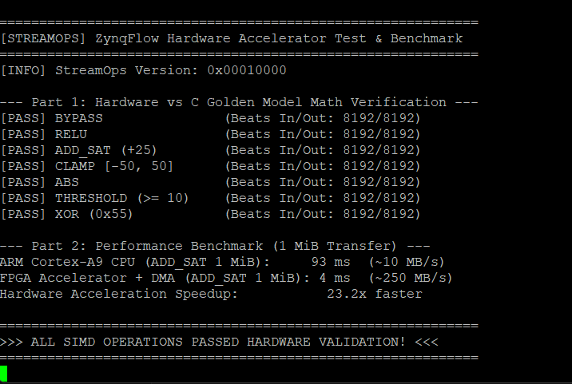
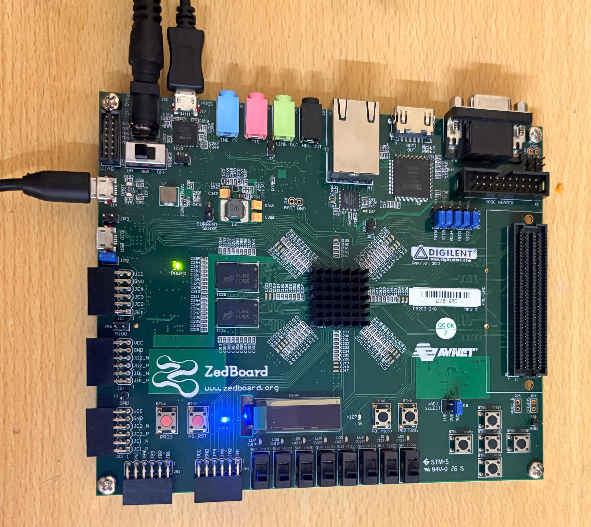
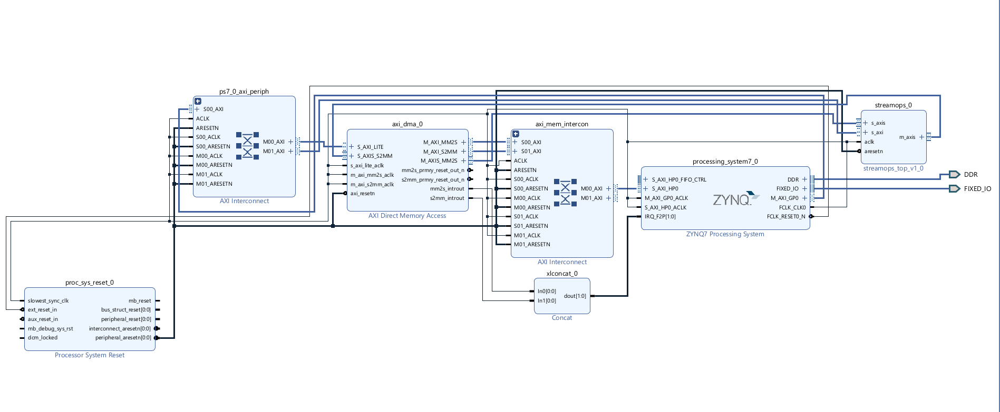

# ZynqFlow: 8-Lane INT8 SIMD Streaming Accelerator with AXI DMA on Zynq-7020


-orange.svg)


ZynqFlow is a hardware-verified Zynq PS–PL streaming system that processes eight signed 8-bit integers (INT8) per 64-bit AXI4-Stream beat. The design uses AMD AXI DMA to stream data buffers between DDR3 memory and a custom Verilog SIMD accelerator (`StreamOps`), controlled via memory-mapped AXI4-Lite registers by the dual-core ARM Cortex-A9 host processor.

---

## Measured Performance Baseline

On a 1 MiB INT8 vector workload (1,048,576 elements), the StreamOps accelerator and DMA pipeline completed end-to-end processing in **4 ms** (~250 MB/s), compared to **93 ms** (~10 MB/s) on the ARM Cortex-A9 software baseline, achieving a measured **23.2x hardware speedup**.

<p align="center">
  
</p>
<p align="center"><em>Figure 1: Hardware UART terminal log showing verification across all 7 SIMD math modes and 23.2x speedup benchmark.</em></p>

---

## Hardware Setup & System Block Design

<p align="center">
  <br>
  <em>Figure 2: Physical Digilent ZedBoard (Zynq-7020) target platform during active execution.</em>
</p>

<br>

<p align="center">
  <br>
  <em>Figure 3: Vivado IP Integrator Block Design showing Zynq PS7, AXI DMA v7.1, Interconnects, and custom StreamOps IP core.</em>
</p>

---

## System Overview

| Property | Specification |
| :--- | :--- |
| **Target Device** | Xilinx Zynq-7020 (`xc7z020clg484-1`) on Digilent ZedBoard |
| **Host Processor** | Dual ARM Cortex-A9 @ 667 MHz with 512 MB DDR3 RAM |
| **Accelerator Core** | `StreamOps` 8-Lane INT8 SIMD Data Processor |
| **Stream Bus Width** | 64-bit AXI4-Stream (8 INT8 elements per beat) |
| **Control Interface** | 32-bit AXI4-Lite Slave mapped at `0x40000000` |
| **DMA Subsystem** | AMD AXI DMA v7.1 (Direct / Simple Mode, 23-bit length width) |
| **System Clock** | 100 MHz (`FCLK_CLK0`) |
| **IP Resource Footprint** | 784 LUTs (1.47%), 348 FFs (0.33%), 0 BRAM, 0 DSP |
| **Full Placement Utilization** | 3,472 LUTs (6.53%), 4,095 FFs (3.85%), 3 BRAM Tiles |
| **RTL Verification** | 23 directed & randomized test cases (10,000+ beats) |
| **Hardware Verification** | 100 consecutive 1 MiB stress transfers with 0 data errors |

---

### End-to-End Execution Sequence
1. **Buffer Allocation**: Software allocates source `TX` (`0x01000000`) and destination `RX` (`0x01200000`) buffers in DDR3 RAM.
2. **Cache Coherency**: CPU flushes cache lines (`Xil_DCacheFlushRange`) for the source buffer prior to DMA start.
3. **Accelerator Configuration**: CPU configures StreamOps mode, immediates, and clamp limits via AXI4-Lite.
4. **DMA Trigger**: CPU initializes S2MM receive channel, followed by MM2S transmit channel.
5. **Memory Streaming**: AXI DMA streams data from DDR3 via High-Performance Port 0 (`S_AXI_HP0`).
6. **SIMD Acceleration**: StreamOps transforms 8 signed INT8 values per 100 MHz clock cycle.
7. **Destination Transfer**: AXI DMA writes output stream back to DDR3 via `S_AXI_HP0`.
8. **Cache Invalidation**: CPU invalidates destination cache lines (`Xil_DCacheInvalidateRange`) before verifying output memory.

---

## StreamOps Accelerator Core

The StreamOps accelerator core consists of 4 modular Verilog RTL files in [`rtl/`](rtl/):

- [`streamops_lane.v`](rtl/streamops_lane.v): Combinational signed INT8 arithmetic processing unit.
- [`streamops_axis.v`](rtl/streamops_axis.v): 64-bit AXI4-Stream datapath with 8 parallel lanes and event counters.
- [`streamops_axil_regs.v`](rtl/streamops_axil_regs.v): AXI4-Lite register interface and hardware performance counters.
- [`streamops_top.v`](rtl/streamops_top.v): Top-level wrapper for Vivado IP packaging.

### Supported SIMD Operations

| Mode ID | Name | Expression | Parameter Inputs | Boundary & Saturation Behavior |
| :---: | :--- | :--- | :--- | :--- |
| `0` | **BYPASS** | $y = x$ | None | Direct passthrough |
| `1` | **RELU** | $y = \max(x, 0)$ | None | Clamps negative inputs to `0` |
| `2` | **ADD_SAT** | $y = \text{saturate}(x + \text{imm8})$ | `imm8` (signed INT8) | Clamps overflow to `+127` and underflow to `-128` |
| `3` | **CLAMP** | $y = \text{clamp}(x, \text{lo}, \text{hi})$ | `clamp_lo`, `clamp_hi` | Clamps input to specified $[ \text{lo}, \text{hi} ]$ range |
| `4` | **ABS** | $y = \vert x \vert$ | None | Saturates `-128` to `+127` |
| `5` | **THRESHOLD** | $y = (x \ge \text{imm8}) ? +127 : 0$ | `imm8` (signed INT8) | Binary thresholding (`+127` or `0`) |
| `6` | **XOR** | $y = x \oplus \text{imm8}$ | `imm8` (byte mask) | Bitwise logical XOR |

---

## AXI4-Lite Register Map (`0x40000000`)

| Byte Offset | Register | Access | Description |
| :---: | :--- | :---: | :--- |
| `0x00` | **CTRL** | R/W | `bit[0]`: Enable, `bit[1]`: Clear counters (pulse), `bit[2]`: Soft reset |
| `0x04` | **MODE** | R/W | `bits[2:0]`: Operation selector (0 to 6) |
| `0x08` | **IMM8** | R/W | `bits[7:0]`: Signed 8-bit immediate value |
| `0x0C` | **CLAMP** | R/W | `bits[7:0]`: `clamp_lo`, `bits[15:8]`: `clamp_hi` |
| `0x10` | **STATUS** | RO | `bit[0]`: Enable, `bit[1]`: `s_axis_tready`, `bit[2]`: `m_axis_tvalid` |
| `0x14` | **INPUT_BEATS** | RO | Hardware counter of accepted input AXI-Stream beats |
| `0x18` | **OUTPUT_BEATS** | RO | Hardware counter of transferred output AXI-Stream beats |
| `0x1C` | **STALL_CYCLES** | RO | Hardware counter of downstream stall cycles (`TVALID && !TREADY`) |
| `0x20` | **FRAME_COUNT** | RO | Hardware counter of completed frames (`TLAST` transfers) |
| `0x24` | **ACTIVE_CYCLES** | RO | Hardware counter of active processing cycles |
| `0x28` | **VERSION** | RO | Constant `0x00010000` (Version 1.0 hardware ID) |

---

## RTL Verification

A self-checking Verilog testbench is located in [`tb/tb_streamops.v`](tb/tb_streamops.v) with AXI-Stream Source ([`axis_source_bfm.v`](tb/axis_source_bfm.v)) and Sink ([`axis_sink_bfm.v`](tb/axis_sink_bfm.v)) Bus Functional Models.

- **Coverage**: 23 directed and randomized test cases covering edge cases (-128, -127, 0, 127) across all modes.
- **Stall & Backpressure Verification**: Exercises randomized producer `TVALID` gaps and consumer `TREADY` stalls.
- **AXI Compliance**: Confirms that `tdata`, `tkeep`, and `tlast` remain stable during backpressure without frame corruption.

---

## Resource Utilization & Implementation

Target Device: **Xilinx Zynq-7020 (xc7z020clg484-1)** | Clock: **100 MHz (`FCLK_CLK0`)**

### 1. Custom StreamOps IP (Standalone Synthesis)
| Resource | Used | Available | Utilization % |
| :--- | :---: | :---: | :---: |
| **Slice LUTs** | **784** | 53,200 | **1.47%** |
| **Slice Registers (FF)** | **348** | 106,400 | **0.33%** |
| **Block RAM (BRAM)** | **0** | 140 | **0.00%** |
| **DSP Blocks** | **0** | 220 | **0.00%** |
| **Inferred Latches** | **0** | — | **0 (Clean)** |

### 2. Complete System Implementation (`zynqflow_bd_wrapper` Placed)
| Component / Module | Slice LUTs | Slice Registers (FFs) | BRAM Tiles | Utilization % |
| :--- | :---: | :---: | :---: | :---: |
| **StreamOps Accelerator IP** | 784 | 348 | 0 | LUT: 1.47% |
| **AMD AXI DMA v7.1 Core** | 1,803 | 2,404 | 3 | LUT: 3.39% |
| **AXI Interconnects & Peripherals** | 885 | 1,343 | 0 | LUT: 1.67% |
| **Total System** | **3,472** | **4,095** | **3** | **LUT: 6.53% \| FF: 3.85%** |

*Raw implementation report archived in [`results/utilization_placed.rpt`](results/utilization_placed.rpt).*

---

## Repository Structure

```
ZynqFlow/
├── README.md                           Project documentation
├── LICENSE                             MIT License
├── rtl/                                Verilog-2001 RTL Sources
│   ├── streamops_lane.v                INT8 SIMD arithmetic processing unit
│   ├── streamops_axis.v                64-bit 8-lane AXI4-Stream pipeline
│   ├── streamops_axil_regs.v           AXI4-Lite control interface & counters
│   └── streamops_top.v                 Top-level IP wrapper module
├── tb/                                 Verilog Simulation Environment
│   ├── tb_streamops.v                  Self-checking testbench
│   ├── axis_source_bfm.v               AXI4-Stream master BFM with TVALID control
│   └── axis_sink_bfm.v                 AXI4-Stream slave BFM with TREADY control
├── vivado/                             Vivado Build Scripts
│   ├── create_bd.tcl                   Initial Block Design generation script
│   └── block_c.tcl                     Custom IP packaging and bitstream build script
├── software/                           Bare-Metal C Firmware for Vitis
│   └── main.c                          Hardware test suite and benchmark application
├── docs/                               Documentation & Images
│   └── images/                         Board setup photo and block design diagrams
└── results/                            Experimental Results & Evidence
    ├── uart_hardware_benchmark.log     Raw UART benchmark log output
    └── utilization_placed.rpt          Vivado post-implementation utilization report
```

---

## Build & Execution Instructions

### Prerequisites
- **AMD Vivado 2022.1**
- **AMD Vitis 2022.1**
- **Digilent ZedBoard** (Zynq-7020) with 12V DC power supply and Micro-USB cables

### 1. Hardware Build (Vivado)
Run the automated Tcl script in Vivado Tcl Console:
```tcl
source vivado/block_c.tcl
```
*Packages `StreamOps` as a custom IP, generates the Zynq block design, completes synthesis and placement, generates bitstream, and exports hardware platform `zynqflow_bd_wrapper.xsa`.*

### 2. Software Compilation & Run (Vitis)
1. Open Vitis 2022.1 and import platform `zynqflow_bd_wrapper.xsa`.
2. Add [`software/main.c`](software/main.c) to application project.
3. Configure UART `115200` baud on `ps7_uart_1`.
4. Connect ZedBoard over USB and select **Run / Launch Hardware**.

---

## Design Considerations

1. **Stream Width Selection**: 64-bit stream width packs 8 INT8 elements per beat, matching native AXI DMA interconnect width and avoiding bit-realignment cycles.
2. **Cache Management**: Explicit cache flush (`Xil_DCacheFlushRange`) before DMA transmission ensures RAM contents match CPU writes. Invalidation (`Xil_DCacheInvalidateRange`) after DMA completion prevents stale cache reads.
3. **Transfer Length Extension**: Configured `c_sg_length_width = 23` in AXI DMA parameters to support contiguous transfers up to 8 MB.
4. **Pipeline Backpressure Protocol**: Single-stage holding register with `can_accept = !out_valid || m_axis_tready` guarantees zero-bubble throughput while preserving pending transfers during backpressure stalls.

---

## License
This repository is licensed under the [MIT License](LICENSE).
